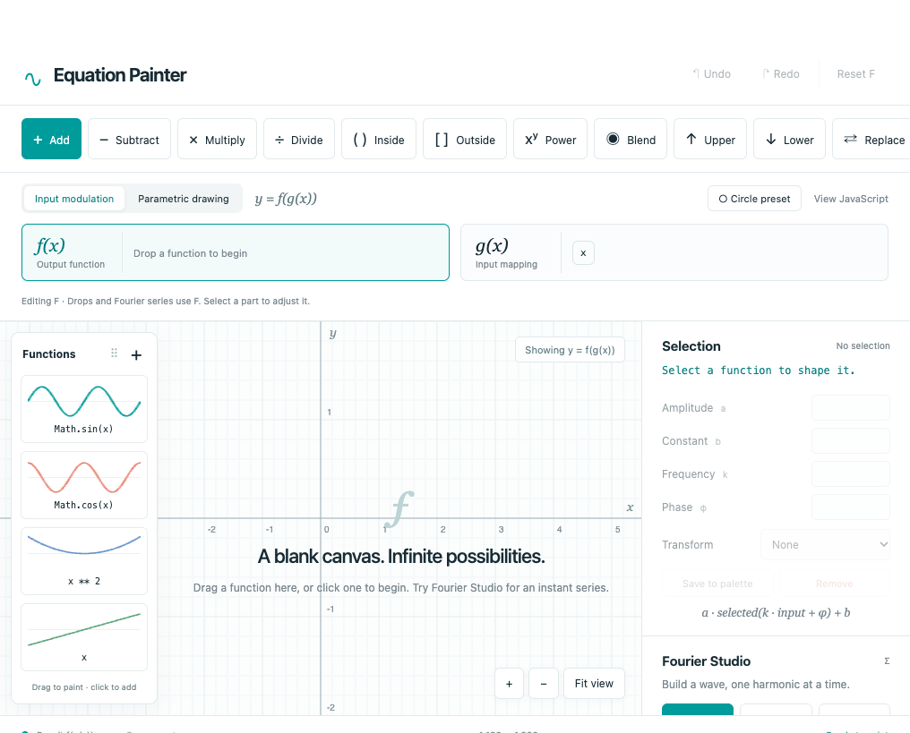
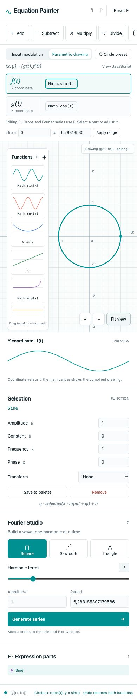
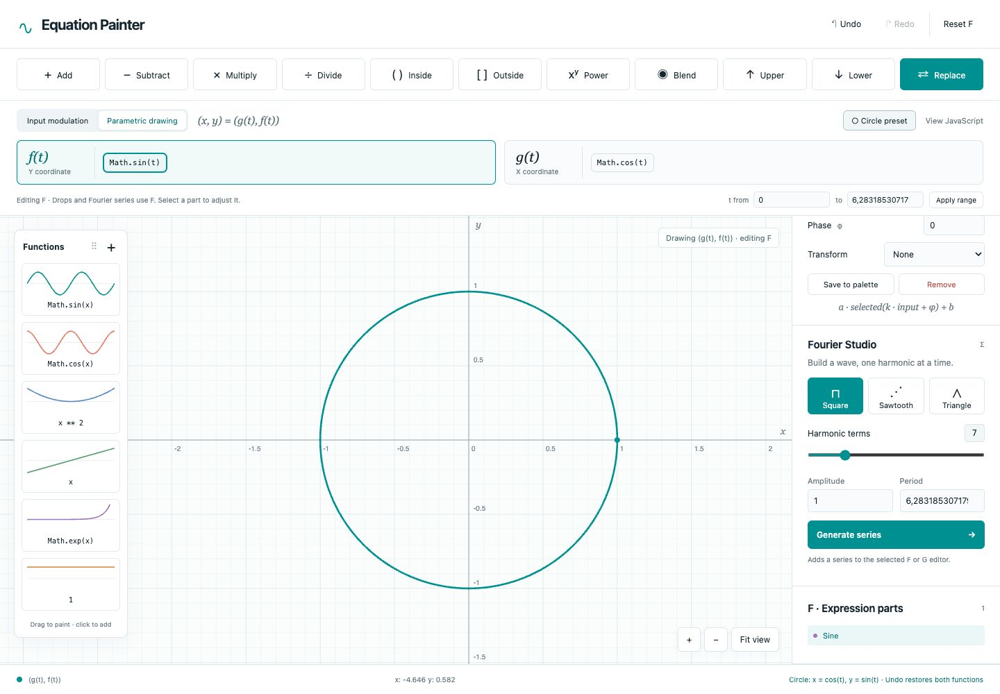
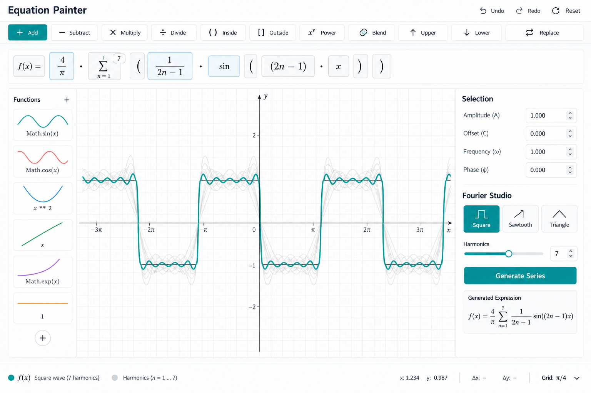

# Equation Painter

An offline, dependency-free HTML/CSS/JavaScript function playground.

Open **index.html** directly in a modern browser. No npm, build, server, or network connection is required. Classic scripts are loaded in dependency order so `file://` works too.

## Two function editors

Choose **F** or **G** in the top expression area. Palette clicks, canvas drops, Fourier generation, and the inspector act on that editor. Dropping directly on an expression block or editor targets it explicitly, even if the other editor is selected. F starts empty and G starts as the identity `g(x) = x`.

- **Input modulation:** selecting G plots `g(x)` so you can shape the input mapping. Selecting F plots the complete `f(g(x))`. For example, set F to sine and use Replace to set G to `x ** 2`: the F view plots `sin(x²)`.
- **Parametric drawing:** the plot traces `(g(t), f(t))` over the editable t interval. F is the Y coordinate; G is the X coordinate. Selecting either editor leaves the combined drawing visible, and the sidebar previews that coordinate versus t. X and Y use the same pixel scale to preserve geometry. A dot marks the start of the trace.
- **Circle preset:** replaces both functions with `g(t) = cos(t)` and `f(t) = sin(t)`, selects parametric mode, and sets t to 0…2π. Undo restores both previous functions and the previous mode. Set G's amplitude to 2 to turn the circle into an ellipse.

Mode changes preserve both trees. **Reset F** clears F; **Reset G** restores G to identity. Removing the last G part also restores identity. Undo/Redo includes both trees, selections, mode, and parameter interval. View JavaScript exports both functions and either the composed result or the parametric point function, including interval limits.

The palette stays reusable across modes: its `x` variable becomes the input parameter `t` when used in parametric drawing. Built-in cards include powers through quartic, exponential and logarithmic curves, a Gaussian, sigmoid, tanh, Lorentzian, and damped sine. Custom expressions accept either `x` or `t` as names for the same input.

## Paint a function

Choose an operator at the top, then drag a function onto the plot (or click a palette card). An empty plot adopts the first function. Subsequent canvas drops combine with the full expression of the selected F or G editor. Drop on an expression block or a row in Expression parts to combine with that specific part instead.

Select a block or row to edit amplitude, additive constant, frequency, phase, or a unary transform. The inspector applies `a * transform(f(k*x + phase)) + b`. Groups can be selected and transformed too. In modulation mode the orange overlay shows the selected part and pale curves show individual leaves; in the F view each uses g(x) as its input. They are standalone part previews, not additive contributions through arbitrary operations. Parametric mode instead uses the coordinate preview and does not overlay component graphs on the drawing.

Inside means `f(g(x))`; Outside means `g(f(x))`. Blend is `(1-t)*f(x) + t*g(x)`; select the Blend group to adjust t. Upper and Lower are pointwise max/min. All operations preserve their expression tree and explicit grouping. View JavaScript expands the full exact expression, including folded groups.

Drag the palette by its header to move it. Drag the canvas to pan; scroll to zoom. Fit view restores a useful centered view. Undo/Redo covers all expression mutations. Reset is undoable. Save to palette makes the selected function or group reusable. Click + to add a custom expression with a live thumbnail preview.

## Use-cases

Equation Painter could become a general “function design studio”: you start from simple primitives, compose them, inspect the shape, and tune parameters until the result has the behavior you need.

Some especially promising uses:

### Signal and music design

Beyond Fourier reconstruction, it could help design:

- Oscillators and wavetable synths.
- ADSR-like envelopes and custom amplitude curves.
- Crossfades and equal-power fades.
- Waveshaping and distortion functions.
- Filter response curves.
- LFOs with custom modulation shapes.
- Window functions for FFT work: Hann, Blackman, Kaiser, Tukey, and custom windows.
- Approximation of a target sound by a finite Fourier series.

TODO: A useful feature here would be a “harmonic view” showing the function and its spectrum side by side. Add an ADSR function. Consider to play the sound

### Neural-network transfer functions

It could be used to design and compare activation functions:

- ReLU, leaky ReLU, ELU, GELU, sigmoid, tanh, softplus.
- Piecewise activations.
- Bounded activations for stable outputs.
- Functions with controlled slope near zero.
- Functions with asymmetric positive and negative behavior.
- Custom functions optimized for gradient flow.

TODO: The inspector could show not only `f(x)`, but also `f′(x)` and perhaps `f″(x)`. That would make saturation, dead zones, curvature, and exploding gradients immediately visible.

### Control systems

You could design:

- Smooth step responses.
- Dead-zone and saturation curves.
- PID shaping functions.
- Gain schedules.
- Hysteresis approximations.
- Sensor calibration curves.
- Actuator mappings.
- Trajectory profiles with bounded velocity and acceleration.

TODO: For this domain, constraints matter. A function might need to be monotonic, bounded, continuous, or have zero slope at both ends. Equation Painter could detect and report whether those conditions are satisfied.

### Robotics and motion

Parametric mode makes it useful for:

- Robot paths.
- Camera paths.
- Ease-in/ease-out motion.
- Bézier-like trajectories.
- Lissajous and harmonic motion.
- Joint interpolation.
- Periodic gait design.
- Smoothing hand-drawn paths.

TODO: A particularly useful extension would be plotting position, velocity, and acceleration simultaneously for `x(t)` and `y(t)`.

### Geometry and shape generation

With parametric functions, it could create:

- Circles and ellipses.
- Spirals.
- Rounded polygons.
- Superellipses.
- Star shapes.
- Gear-like profiles.
- Organic contours.
- Procedural logos.
- Symmetric or tiled motifs.

TODO: A polar mode would make this even more natural! Like:

```text
r = f(θ)
x = r cos(θ)
y = r sin(θ)
```

That would make roses, cardioids, spirals, and radial designs very easy to construct.

### Data fitting and calibration

Given sampled points, Equation Painter could help construct an interpretable approximation:

- Polynomial fitting.
- Fourier fitting.
- Piecewise interpolation.
- Logistic or exponential fitting.
- Splines.
- Robust approximations with clamping or saturation.
- Calibration curves for instruments and sensors.

TODO: We could allo the user to paste a table of points, see the residual error, and adjust a composed model manually.

### Image and graphics processing

A one-dimensional function can describe:

- Brightness or contrast curves.
- Gamma correction.
- Tone-mapping functions.
- Color-channel transfer curves.
- Alpha masks.
- Gradient profiles.

## Fourier Studio

Choose Square, Sawtooth, or Triangle and 1–32 harmonic terms, amplitude A and period T, then Generate series. The series is combined with the selected F or G editor using the current operator. Use Replace to start fresh. Every harmonic is a selectable sine function with editable amplitude, angular frequency, and phase. Re-generating adds a new series, rather than altering the old one.

The studio is also available through the public API. This call generates the same series, updates the visible Fourier Studio controls, fits the plot, and replaces F:

```js
EP.api.do('fourier', {
  wave: 'triangle',       // 'square' | 'sawtooth' | 'triangle'
  terms: 9,               // integer from 1 to 32
  amplitude: 1.5,         // finite number
  period: 4,              // finite positive number
  to: 'f',                // 'f' | 'g'
  op: 'replace'           // any supported paint operation
});
```

`to` and `op` are optional; they default to the active editor and current operation. The period T sets angular frequency ω = 2π/T. `EP.api.paint({wave, terms, amplitude, period}, options)` accepts the same Fourier specification and composes the series into the document; use `do('fourier', ...)` when you also want the studio controls and plot fit to update. Both paths validate the wave type, term count, amplitude, and period. The operation is undoable.

With ω = 2π/T:

- Square: Σ 4A/[π(2j−1)] sin((2j−1)ωx)
- Sawtooth: Σ 2A(−1)^(j+1)/(πj) sin(jωx)
- Triangle: Σ 8A(−1)^(j−1)/[π²(2j−1)²] sin((2j−1)ωx)

Square and triangle use odd harmonics. These are finite approximations; ringing near square/sawtooth jumps is expected. Values are real: undefined points (including negative bases with fractional powers) produce gaps. Plotting is sampled, so extreme zoom, frequencies, or very narrow features can alias.

## Examples

These images are included in [`Images/`](Images/) as visual examples of the project and its plotting workflow.

### Start Screen



### Equation Painter workspace



### Function composition and plotting



### Fourier and parametric drawing reference




## Files

- `index.html` — single application entry point
- `styles.css` — layout and responsive design
- `js/math.js` — restricted math parser, evaluator, and JavaScript serialization; never evals input
- `js/model.js` — expression tree, operations, transforms, Fourier coefficients
- `js/document.js` — independent F/G trees, active editor, plot mode, parameter interval, shared history and export
- `js/plot.js` — function and parametric rendering, equal-scale geometry, grid, discontinuity handling, pan/zoom
- `js/palette.js` — function cards, thumbnails, drag payloads, movable palette
- `js/app.js` — controls, selection, history, dialogs
- `tests/math.test.cjs` — mathematical and expression regression checks
- `tests/document.test.cjs` — F/G isolation, modulation, circle geometry, history, intervals and exports

No persistence in this version: refreshing starts a blank canvas. Copy the full JavaScript expression before closing if you want to keep the result. A saved palette card lasts for the current session.

Run tests with `node tests/math.test.cjs` and `node tests/document.test.cjs`. Parametric curves use 4,096 samples across the selected interval; extremely high frequencies or large intervals can miss detail. Reduce the interval when inspecting fine features.

## Programmatic control

The same page exposes a small controller as `EP.api` (after the scripts load):

```js
EP.api.paint('Math.sin(x)');
EP.api.paint('x ** 2', { to: 'g', op: 'replace' });
EP.api.select('n3', 'f');
EP.api.set({ edit: { a: 2, p: 0.5 }, mode: 'parametric', range: { start: 0, end: 6.283 } });
EP.api.do('undo');
const fSource = EP.api.code('f');
const bothSources = EP.api.code();
const state = EP.api.get();
```

- `paint(expression, options)` adds a math expression, model node, or Fourier spec (`{wave, terms, amplitude, period}`). Options are `to` (`f`/`g`), `op`, `at` (target node id), and `name`.
- `select(target, to)` selects a node id (or node) in an editor.
- `set(options)` changes `to`, `operator`, `mode`, `range`, `selected`, selected-node `edit` values (`a`, `b`, `k`, `p`, `t`, `unary`), component visibility, plot `view` (`x`, `y`, `sx`, `sy`), or palette position (`x`, `y`).
- `do(action, value)` handles `undo`, `redo`, `reset` (active editor), `reset-f`, `reset-g`, `remove`, `circle`, `fit`, `zoom`, `save`, `fourier`, `palette`, `show-code`, `copy-code`, and `close-dialog`.
- `code(channel)` returns a JavaScript arrow-function string for `f` or `g`, or `null` when F is empty. With no channel it returns `{ f, g }`. The variable is `x` in modulation mode and `t` in parametric mode. For example, `EP.api.code('g')` returns `(x) => x` when G is the identity in modulation mode.
- `get()` returns a copy of the current functions and view settings, the palette names and sources, and the generated JavaScript in `code`.

Calls that edit expressions use the app's undo history and redraw the visible UI. Node ids can be read from `get().functions`; they remain valid until that node is replaced or removed. The API controls the current page and is available to browser scripts, bookmarklets, or the developer console; it is not a separate server endpoint.

## AI function assistant

The floating **Ask AI** panel sends prompts to OpenAI using the key entered by the user. It defaults to `gpt-4o-mini`; model availability and pricing can change. The key stays in page memory and is not saved to browser storage. The API request is made directly by the browser, so this is intended for personal experimentation, not for a public/shared deployment. OpenAI recommends keeping standard API keys out of browser clients. Expressions returned by the model are parsed by `EP.Math` and applied through `EP.api.paint()`; model output is never evaluated as JavaScript.

The assistant receives the expression grammar and the Fourier API contract described above. For standard square, sawtooth, or triangle wave requests, it can choose Fourier Studio settings and call `EP.api.do('fourier', ...)`; other function requests become validated expressions passed to `EP.api.paint()`.
